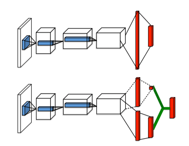

# Duel DQN

Last Edited: Nov 19, 2018 6:06 PM
Tags: RL

## Duel

$$Q(s,a) = V(s) + A(s,a)$$

`Q` 함수를 `V`와 `A`로 분리한다. `A`는 즉 현재의 상태에 대한 기댓값과 행동에 대한 기댓값을 분리한다. 이로써 어떠한 행동에 대한 기댓값을 좀더 잘 추측 할 수 있다. 



구하는 방법은 단순하게 layer 을 하나 더 만들어서 `A`을 output으로 하게 하면된다.

하지만 단순하게 위의 식대로 할 경우 논문에서는 하나의 `Q` 에 대해서 `V`와 `S`가 unique 하지 않게 되고 그것 때문에 성능이 안 좋아진다고 한다. 그래서 

$$Q(s,a) = V(s) + (A(s,a) - max_{a'}A(s,a'))$$

로 식을 바꾼다. 이로써 Q 가 수렴 되었을 때는 항상 가장 좋은 액션만 선택한다고 되었을 때이고 뒤의 `A` 항이 전부다 0이 되기 때문에 하나의 Q 값에 대해서 V와 A에 대한 항 부분을 unique 하게 찾을 수 있다.

$$Q(s,a) = V(s) + (A(s,a) - Avg(A))$$

그리고 다시 식을 위처럼 바꾸는데, 위의 식처럼 할 경우 `A`항의 부분이 0이 되는게 더 빨리 수렴이 되기 때문에 더 빠르게 학습이 된다고 한다. 위의 경우는 max 로 수렴, 밑의 부분은 평균으로 수렴.

```python
class DuelDQNet(nn.Module):
    def __init__(self, num_inputs, num_outputs):
        super(DuelDQNet, self).__init__()
        self.num_inputs = num_inputs
        self.num_outputs = num_outputs

        self.fc = nn.Linear(num_inputs, 128)
        self.fc_adv = nn.Linear(128, num_outputs)
        self.fc_val = nn.Linear(128, 1)

        for m in self.modules():
            if isinstance(m, nn.Linear):
                nn.init.xavier_uniform(m.weight)

    def forward(self, x):
        x = F.relu(self.fc(x))
        adv = self.fc_adv(x)
        val = self.fc_val(x)

        qvalue = val + (adv - adv.mean())
        return qvalue
```

실제 구현에서는 이렇게 간단하게 `adv`와 `val` 을 나눠서 마지막에 `qvalue`을 만들어 주는 것만으로 구현이 가능하다.