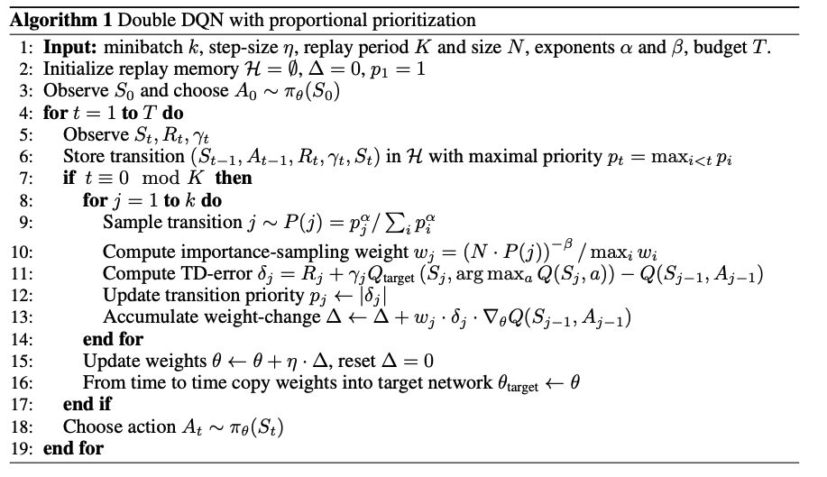

# Prioritized Experience Replay

Last Edited: Nov 15, 2018 4:27 PM
Tags: RL

# 논문

[https://arxiv.org/pdf/1511.05952.pdf](https://arxiv.org/pdf/1511.05952.pdf)

## 기본 내용

TD Error

$$error= |Q(s,a) - (reward + argmax_aQ(s', a'))|$$

DQN에서는 이걸 0로 만드는 것을 목표로 학습을 시켰음. 이걸 더 빨리 학습시킬수 있는 방법으로서 이 error가 더 크면 이 경험을 더 자주 사용해서 빨리 error을 0로 만드는게 목적

경험 i 가 선택될 확률을

$$P(experience_i) = \frac {|error_i|} {\sum_j |error_j|}$$

로 표현해서 만듬.

# 구현 법

## 단순 구현법

```python
# 1. 모든 td_error의 합을 구한다.
sum_td_error = sum(abs(td_error) for td_error in td_errors))

# 2. 0 ~ sum_td_error 사이의 랜덤한 숫자를 고른다.
random_number = np.random.uniform(0, sum_td_error) 

# 3. 랜덤한 idx을 고른다.
# 이미지 상으로는 전체 끈이 있고 각각의 td 값 만큼 각기 다른 색으로 색칠
# 그 뒤에 랜덤한 길이의 부분을 고른다는 느낌.
tmp_sum_error = 0
idx = 0
while tmp_sum_error < random_number:
	tmp_sum_error += abs(td_errors[idx])
	idx += 1

memory.push(idx)

# 3을 여러번 반복하여서 memory에 batch_size 만큼 experience을 넣은 후 그걸 이용해서
# replay 나머지는 같음
```

## Segment Tree 사용법

위의 방법은 memory을 만들 때 `O(batch_size * len(td_erros))` 만큼의 계산량을 가지기 때문에 이미 부분을 Segment Tree 을 사용해서 `O(batch_size * log(len(td_erros)))` 으로 최적화 가능. Segment Tree 검색 하는게 빨라요.

## Numpy random choice 사용법

 

```python
td_sum = sum(self.td_memory)
p = [td_error / td_sum for td_error in self.td_memory]
indexes = np.random.choice(np.arange(len(self.memory)), batch_size, p=p)
transitions = [self.memory[idx] for idx in indexes]
```

이게 제일 간단한 방법 같은데 아마 성능상의 이유로 Segment Tree 을 쓰는 예제가 많은 것 같음. 아마?

여기서는 3번째 방법을 이용해서 논문을 구현합니다.

## Memory_With_TDError

```python
class Memory_With_TDError(Memory):
    def __init__(self, capacity, alpha, beta):
        self.memory = deque(maxlen=capacity)
        self.memory_probabiliy = deque(maxlen=capacity)
        self.capacity = capacity
        self.alpha = alpha
        self.beta = beta

    def push(self, state, next_state, action, reward, mask):
        """Saves a transition."""
        max_probability = max(self.memory_probabiliy)
        self.memory.append(Transition(state, next_state, action, reward, mask))
        self.memory_probabiliy.append(max_probability)

    def sample(self, batch_size, net, target_net):
        probability_sum = sum([pow(probability, alpha) for probability in self.memory_probabiliy])
        p = [pow(probability, alpha) / probability_sum for probability in self.memory_probabiliy]
        indexes = np.random.choice(np.arange(len(self.memory)), batch_size, p=p)
        transitions = [self.memory[idx] for idx in indexes]
        batch = Transition(*zip(*transitions))

        weight = pow((self.capacity * p), -self.beta)
        weight = weight / max(weight)

        td_error = self.get_td_error(batch.state, batch.next_state, batch.action, batch.reward, batch.mask, gamma, net, target_net)
        for idx in indexes:
            self.memory_probabiliy[idx] = abs(td_error[idx]) + small_epsilon
        return batch

    def __len__(self):
        return len(self.memory)

    def get_td_error(self, state, next_state, action, reward, mask, net, target_net):
        state = torch.stack([state])
        next_state = torch.stack([next_state])
        action = torch.Tensor([action]).long()
        reward = torch.Tensor([reward])
        mask = torch.Tensor([mask])

        pred = net(state).squeeze(1)
        next_pred = target_net(next_state).squeeze(1)

        one_hot_action = torch.zeros(1, pred.size(-1))
        one_hot_action.scatter_(1, action.unsqueeze(1), 1)
        pred = torch.sum(pred.mul(one_hot_action), dim=1)

        target = reward + mask * gamma * next_pred.max(1)[0]

        td_error = pred - target

        return td_error
```



논문과 하나하나 비교를 해 봅시다.

일단 6번째 행을 보면 `experience` 가 생기면 그 확률을 지금까지의 확률배열에서의 최댓값을 확률로 해서 경험배열에 넣습니다. 이 부분은 `push` 에 구현되어 있습니다.

그리고 9번째 행을 보시면 샘플을 뽑을때 P(j) 라는 확률을 통해서 뽑습니다. 

```python
probability_sum = sum([pow(probability, alpha) for probability in self.memory_probabiliy])
p = [pow(probability, alpha) / probability_sum for probability in self.memory_probabiliy]
indexes = np.random.choice(np.arange(len(self.memory)), batch_size, p=p)
transitions = [self.memory[idx] for idx in indexes]
batch = Transition(*zip(*transitions))
```

이렇게 해서 batch을 만듭니다.

그후 weight을 계산합니다.

```python
weight = pow((self.capacity * p), -self.beta)
weight = weight / max(weight)
```

그 뒤 batch의 `td_error`을 새로 계산을 해주고 그 값으로 p 을 업데이트 해줍니다. 단 `small_epsilon` 이라는 값을 주어서 확률이 0가 되는 것을 방지합니다.

```python
td_error = self.get_td_error(batch.state, batch.next_state, batch.action, batch.reward, batch.mask, gamma, net, target_net)
for idx in indexes:
    self.memory_probabiliy[idx] = abs(td_error[idx]) + small_epsilon
```