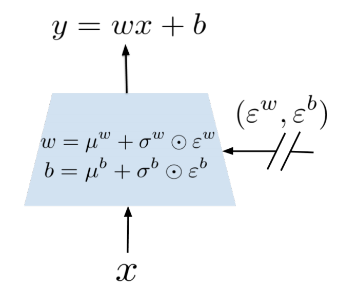

# Noisy Net

Last Edited: Nov 16, 2018 7:48 PM
Tags: RL

## 논문

[https://arxiv.org/pdf/1706.10295.pdf](https://arxiv.org/pdf/1706.10295.pdf)

일반적으로 탐색을 할때 두가지 방법을 사용합니다.

1. epsilon-greedy : 지금까지 보통 써왔던 방법으로 특정 확률로 랜덤한 액션을 선택하게 합니다.
2. entropy regularisation: 일반적으로 policy-gradient 방법에 자주 사용됩니다.

이 논문에서는 신경망 전체에 noisy 을 주는 방법을 제안하고 있습니다. 이 noisy 을 통해서 탐색을 한다는 것 입니다. 이 방법이 전통적인 탐색 방법 보다 더 좋다는 것은 논문에서 증명되어 있지 않은 것 같습니다. (제가 논문을 잘 이해를 못한 부분 일 수도 있습니다) 결과론적으로 봤을 때 더 잘됬네 라는 느낌인것 같습니다만 제 느낌적인 부분으로는 일반적으로 epsilon-greedy 는 점점 decay 되면서 탐험의 의미가 사라지고 state 나 network 에 상관없이 무작위라는 특성이 있습니다. 그에 비해  noisy-net 은 그때그때 다르기 때문에 좀더 의미 있는 탐색을 하는 것 같습니다. 만약 action A,B 의 Q 값이 100, 10 등 확연히 차이가 날 때에는 무조건 A를 선택하는게 좋고 B를 선택하는 경험은 큰 필요가 없습니다만 A,B 의 값이 51, 50 일 경우 거의 비슷하기 때문에 많은 탐험을 하는게 중요할 것 같습니다. nosiy-net 은 전체 신경망에 대해서 nosie 을 주기 때문에 이러한 의미 있는 탐색을 더 하는 것 같습니다.  또한 epsilon-greedy 의 경우 decay 의 값과 최소 epsilon 값 등 hyper-parameter 가 존재하는데 그에 비해 noisy net 은 그런 hyper-parameter 에 의한 차이가 적다고 생각됩니다.

일반적인 linear layer 의 식은 

$$y = wx + b$$

인데 여기서 w 와 b 를

$$w = u^w+\sigma^w*\epsilon^w, b = u^b+\sigma^b*\epsilon^b$$

$$u, w \ are \ leanable, \ \epsilon \ is \ random$$



그림으로는 이런 느낌 입니다. epsilon 을 정의 하는 방법 2가지를 제안 하고 있습니다.

1. Independent Gaussian noise: 모든 요소에 대해서 랜덤을 사용하는 방식입니다. 이 식에서 필요한 epsilon 변수는 총 pq+q 개 입니다.(p: input_size, q: output_size) 계산량이 많기 때문에 DQN 등에서는 사용하지 않고 A3C 에서 사용한다고 논문에서는 말합니다.
2. Factorised Gaussian noise: 랜덤한 변수를 (p+q) 개만 만들고 나머지는 계산을 통해서 만듭니다.  

$$\epsilon^w_{i,j} = f(\epsilon_i)f(\epsilon_j), \epsilon^b_j=f(\epsilon_j)$$

그리고 f 는 실함수로써 논문에서는 

$$f(x)=sgn(x)\sqrt{|x|}$$

을 사용합니다.

# 실제구현

```python
class NoisyLinear(nn.Module):
  def __init__(self, in_features, out_features):
    super(NoisyLinear, self).__init__()
    self.in_features = in_features
    self.out_features = out_features
    self.sigma_zero = sigma_zero
    self.weight_mu = nn.Parameter(torch.empty(out_features, in_features))
    self.weight_sigma = nn.Parameter(torch.empty(out_features, in_features))
    self.register_buffer('weight_epsilon', torch.empty(out_features, in_features))
    self.bias_mu = nn.Parameter(torch.empty(out_features))
    self.bias_sigma = nn.Parameter(torch.empty(out_features))
    self.register_buffer('bias_epsilon', torch.empty(out_features))
    self.reset_parameters()
    self.reset_noise()

  def reset_parameters(self):
    mu_range = 1 / math.sqrt(self.in_features)
    self.weight_mu.data.uniform_(-mu_range, mu_range)
    self.weight_sigma.data.fill_(self.sigma_zero / math.sqrt(self.in_features))
    self.bias_mu.data.uniform_(-mu_range, mu_range)
    self.bias_sigma.data.fill_(self.sigma_zero / math.sqrt(self.out_features))

  def _scale_noise(self, size):
    x = torch.randn(size)
    return x.sign().mul_(x.abs().sqrt_())

  def reset_noise(self):
    epsilon_in = self._scale_noise(self.in_features)
    epsilon_out = self._scale_noise(self.out_features)
    self.weight_epsilon.copy_(epsilon_out.ger(epsilon_in))
    self.bias_epsilon.copy_(epsilon_out)

  def forward(self, input):
    return F.linear(input, self.weight_mu + self.weight_sigma * self.weight_epsilon, self.bias_mu + self.bias_sigma * self.bias_epsilon)
```

일단 필요한 변수들을 만들어 줍니다. 

```python
self.in_features = in_features
self.out_features = out_features
```

Input 과 Output 의 차원입니다.

```python
self.weight_mu = nn.Parameter(torch.empty(out_features, in_features))
self.weight_sigma = nn.Parameter(torch.empty(out_features, in_features))
self.register_buffer('weight_epsilon', torch.empty(out_features, in_features))
self.bias_mu = nn.Parameter(torch.empty(out_features))
self.bias_sigma = nn.Parameter(torch.empty(out_features))
self.register_buffer('bias_epsilon', torch.empty(out_features))
```

`weight_mu` 와 `weight_sigma` 는 (output * Input) 의 차원을 가지고 있습니다. 또한 `learnable` 한 변수 이기 때문에 `nn.Parameter`로 만들어 줍니다. `weight_epsilon` 은 학습하는 변수가 아니기 때문에 `torch.empty` 로 만들어 주고 `register_buffer`로 이름을 지정해 줍니다. bias 또한 비슷한 방법으로 합니다.

```python
def reset_parameters(self):
    mu_range = 1 / math.sqrt(self.in_features)
    self.weight_mu.data.uniform_(-mu_range, mu_range)
    self.weight_sigma.data.fill_(self.sigma_zero / math.sqrt(self.in_features))
    self.bias_mu.data.uniform_(-mu_range, mu_range)
    self.bias_sigma.data.fill_(self.sigma_zero / math.sqrt(self.out_features))
```

parameter 을 초기화 해줍니다. 초기화 값은 논문에 나와있습니다.

Factorised Noisy Network 의 경우에는 `u` 는 independent uniform distribution 

$$u[-\frac {1} {\sqrt{p}}, +\frac {1} {\sqrt{p}}]$$

을 따르는 값으로, `sigma` 는 

$$\frac {\sigma_0} {\sqrt{p}}$$

로 초기화 한다고 합니다. 논문에서는 `sigma_zero`를 0.5 로 주었다고 합니다.

```python
def _scale_noise(self, size):
    x = torch.randn(size)
    return x.sign().mul_(x.abs().sqrt_())
```

f(x) 의 부분입니다. 밑의 식의 논문대로 구현합니다.

$$f(x)=sgn(x)\sqrt{|x|}$$

```python
def reset_noise(self):
    epsilon_in = self._scale_noise(self.in_features)
    epsilon_out = self._scale_noise(self.out_features)
    self.weight_epsilon.copy_(epsilon_out.ger(epsilon_in))
    self.bias_epsilon.copy_(epsilon_out)
```

noise 을 reset 시켜주는 부분입니다. 밑의 식의 논문대로 구현합니다.

$$\epsilon^w_{i,j} = f(\epsilon_i)f(\epsilon_j), \epsilon^b_j=f(\epsilon_j)$$

```python
def forward(self, input):
    return F.linear(input, self.weight_mu + self.weight_sigma * self.weight_epsilon, self.bias_mu + self.bias_sigma * self.bias_epsilon)
```

이 레이어가 계산하는 부분입니다. 논문의 식대로 구현해주시면 됩니다.

$$w = u^w+\sigma^w*\epsilon^w, b = u^b+\sigma^b*\epsilon^b$$

이제 위의 Noisy-Net 을 사용해봅시다.

```python
class QNet(nn.Module):
    def __init__(self, num_inputs, num_outputs):
        super(QNet, self).__init__()
        self.num_inputs = num_inputs
        self.num_outputs = num_outputs

        self.fc1 = nn.Linear(num_inputs, 128)
        self.fc2 = NoisyLinear(128, num_outputs)

        for m in self.modules():
            if isinstance(m, nn.Linear):
                nn.init.xavier_uniform(m.weight)

    def forward(self, x):
        self.fc2.reset_noise()
        x = F.relu(self.fc1(x))
        qvalue = self.fc2(x)
        return qvalue
```

보시면 fc2 부분을 NoisyLinear 로 바꾸어 주고 `forward` 부분에서 `reset_noise` 을 호출함으로써 지속적으로 nosie 을 만들어 줍니다. NoisyLayer 는 일반적으로 마지막 부분에 넣는다고 합니다. 물론 모든 Layer 을 NoisyLayer 로 바꾸어도 되지만 개인적으로는 이미 noise 가 들어간 값에 또 noise 를 넣는게 큰 의미가 있는지는 잘 모르겠습니다.


참조 

[https://github.com/Kaixhin/Rainbow](https://github.com/Kaixhin/Rainbow)